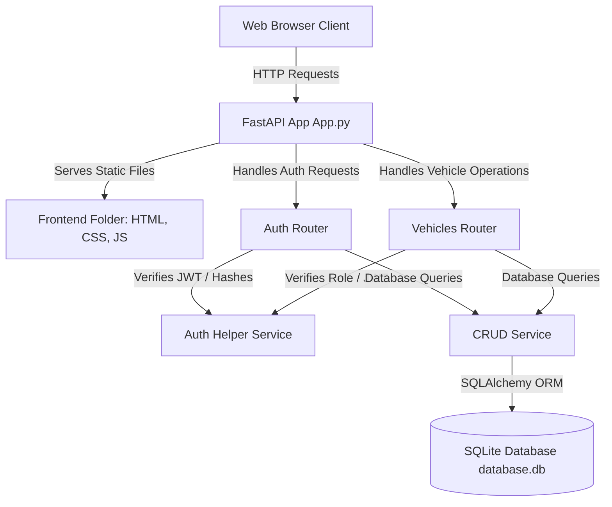

# DriveSync: Car Dealership Inventory System Knowledge Base

Welcome to the **DriveSync** Car Dealership Inventory System codebase documentation. This document explains the system's architecture, file structure, logic flows, and commands for running and developing the application.

---

## 🏗️ Architecture Overview

DriveSync is built as a single-port application. The FastAPI backend serves both the data endpoints (APIs) and the static frontend client files.



---

## 📂 Project Structure

```text
Car-Dealership/
├── backend/
│   ├── routers/
│   │   ├── __init__.py
│   │   ├── auth.py              # Auth endpoints (/auth/register, /auth/login, /auth/me)
│   │   └── vehicles.py          # Vehicles CRUD & actions (/vehicles/...)
│   ├── app.py                   # FastAPI main entrypoint & static mount
│   ├── auth.py                  # Password hashing & JWT generation helpers
│   ├── crud.py                  # SQLAlchemy CRUD operations database layer
│   ├── database.db              # SQLite Database file
│   ├── database.py              # SQLite configuration & session injection
│   ├── models.py                # Database models (User, Vehicle)
│   ├── schemas.py               # Pydantic validation schemas
│   └── requirements.txt         # Backend Python packages list
│
└── frontend/
    ├── app.js                   # Application controller, states, API fetches
    ├── index.html               # UI HTML5 structure
    └── styles.css               # Dark obsidian glassmorphic stylesheet
```

---

## 🔒 Security & Role-Based Access Control (RBAC)

DriveSync utilizes **JWT (JSON Web Tokens)** for stateless authentication.
*   Passwords are encrypted using the **bcrypt** hashing algorithm before saving in the database.
*   Clients obtain a JWT access token upon successful login at `POST /auth/login`.
*   Subsequent requests authenticate using the `Authorization: Bearer <token>` header.

The application enforces role-based authorization to restrict specific endpoints to **Admin** users:

| Endpoint | HTTP Method | Auth Required | Role Allowed | Description |
| :--- | :--- | :--- | :--- | :--- |
| `/auth/register` | `POST` | No | All | Registers a new User or Admin |
| `/auth/login` | `POST` | No | All | Authenticates and returns JWT token |
| `/auth/me` | `GET` | Yes | All | Returns current user profile details |
| `/vehicles/` | `GET` | Yes | All | Lists all vehicles in inventory |
| `/vehicles/{id}` | `GET` | Yes | All | Returns details of a specific vehicle |
| `/vehicles/{id}/purchase` | `POST` | Yes | All | Decrements quantity by 1 |
| `/vehicles/search/{keyword}`| `GET` | Yes | All | Searches vehicles by keyword |
| `/vehicles/` | `POST` | Yes | **Admin** | Creates and adds a new vehicle |
| `/vehicles/{id}` | `PUT` | Yes | **Admin** | Updates vehicle details |
| `/vehicles/{id}` | `DELETE`| Yes | **Admin** | Deletes a vehicle |
| `/vehicles/{id}/restock` | `POST` | Yes | **Admin** | Increments quantity by amount |

---

## 💻 Frontend Client Details

The frontend client is implemented with vanilla web technologies to keep loading times fast and bundle overhead nonexistent.

1.  **UI Layout (`index.html`)**:
    *   Responsive and semantic HTML5 design.
    *   Utilizes a two-card auth container (Login/Register) which toggles visibility.
    *   Dashboard view contains stats metrics cards (Total inventory, value, low stock, categories), a search bar, a dynamic category filtering dropdown, and the main grid structure.
    *   Features dialog modals for adding/editing vehicles and restocking items.
    *   Icons are loaded via **Lucide Icons CDN**.
2.  **Aesthetics (`styles.css`)**:
    *   Obsidian dark theme (`#080b11`) with purple and blue background glow spheres.
    *   Modern sans-serif typography (`Inter`).
    *   Glassmorphism elements (`rgba(255,255,255,0.03)` backgrounds, thin transparent borders, and `backdrop-filter: blur(10px)`).
    *   Pill-shaped badges with stock statuses: In Stock (emerald), Low Stock (orange), Out of Stock (crimson).
3.  **Application Controller (`app.js`)**:
    *   Manages local in-memory states (tokens, logged-in user profile, list of retrieved vehicles, selected search, and category filters).
    *   Sends API requests using browser `fetch`.
    *   Dynamically builds and renders DOM card elements for cars.
    *   Includes a notification toast alert system.

---

## 🛠️ Execution & Deployment Commands

### Running Locally
To launch the unified FastAPI application serving both backend APIs and the frontend client, navigate to the `backend` directory and activate the python virtual environment:

#### Windows (PowerShell)
```powershell
cd backend
.\venv\Scripts\Activate.ps1
python -m uvicorn app:app --reload --port 8000
```

#### macOS / Linux
```bash
cd backend
source venv/bin/activate
python -m uvicorn app:app --reload --port 8000
```

The application will be accessible at: **[http://127.0.0.1:8000](http://127.0.0.1:8000)**.
